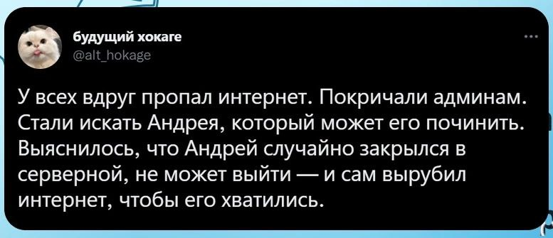

# Кто я?

**ФИО:** Черных Вероника Сергеевна  

**Группа:** 6402-010302D 

**Научный руководитель:** Братченко Иван Алексеевич 

**Тема диплома:** Классификация гиперспектральных изображений новооразований кожи с помощью методов машинного обучения

---

## Единственная цитата философа, которую я помню до сих пор

> "Мне известно, что мне ничего не известно! — Вот последняя правда, открытая мной." —  Омар Хайям

---

*Картинка из смешных интернетов*

---
---

# Лабораторная работа №2
## Цель лабораторной работы: изучение основ HTML и CSS.
### Задание на программирование: разработать многостраничный web-сайт напроизвольно выбранную тему с использованием технологий HTML и CSS, загрузить проект в репозиторий.
### Требования к web-сайту:
1. Количество страниц – от 3 до 5.
2. Требования к HTML: Использование блочных и строчных элементов. Ссылки – от 1 шт. Картинки – от 1 шт. Таблица – от 1 шт.
3. Требование к CSS: Отдельный подключаемый файл. Обязательное использование как минимум 3 видов селекторов. Использование цвета. Использование различных видов выравнивания в таблице (по левому/правому краю и по центру).
4. Запрещено использовать JS, Bootstrap и любые другие библиотеки и фреймворки,всё реализовать самостоятельно.
